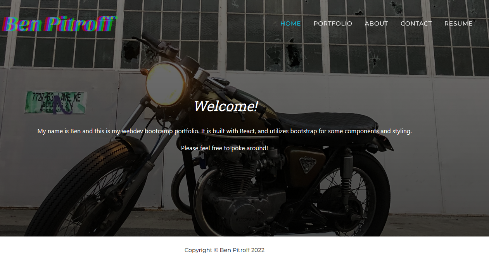
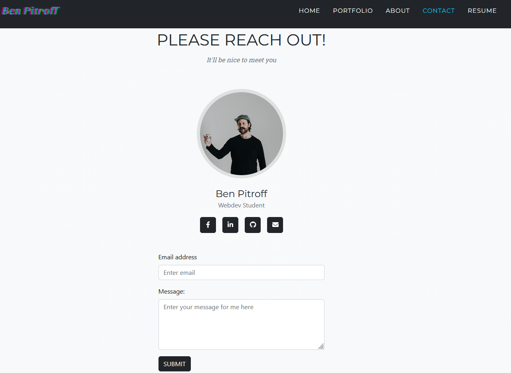

# React Portfolio

   

  ## Description
  This portfolio demonstrates a "single page" React site, utilizine bootstrap for some modules and styling. It shows used of a "static" navbar and footer, and demonstrates the use of rendering an array of objects (on the Portfolio page).

  * * * * * *

  ## [Click here for the live portfolio](https://chicken-react-portfolio.herokuapp.com)

  ## Table of Contents
  1. [Description](#Description)
  2. [Installation](#Installation)
  3. [Usage](#Usage)
  4. [Questions](#questions)
  5. [License](#License)

  * * * * * *

  
  ## Installation
  run "npm i", then run "npm run start"

  
  ## Usage
  
  

* * * * *

  

  
  ## Questions
  For any questions, contact me at dev@chicken1991.anonaddy.com and [visit my github profile](https://github.com/chicken1991).

  
  ## License

